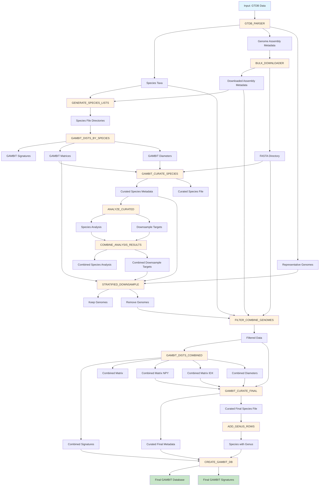

# Getting Started with GAMBITdb-nf

This guide will help you install and run [GAMBITdb-nf](https://github.com/gambit-suite/gambitdb-nf) for the first time.

!!! tip "GAMBITdb-nf input"
    [GAMBITdb-nf](https://github.com/gambit-suite/gambitdb-nf) is designed to take an tsv input from a [GTDB release](https://gtdb.ecogenomic.org/downloads) and filter out potentially poor data based on CheckM2, number of contigs, and where there are less than 2 genomes (defaults). The pipeline will then download the genomes of provided accessions, downsample for species where n genomes is greater than the `downsample_threshold` and create the gambit metadata sqlite file, and the h5 signature file. 

## Workflow Diagram



## Prerequisites

Before running gambitdb-nf, ensure you have:

- **Nextflow** >= 21.10.0
- One of the following container/environment systems:
    - Docker (recommended for local use)
    - Singularity/Apptainer (recommended for HPC)
    - Conda
    - Podman
- **GTDB metadata file** in TSV format
- Sufficient disk space (varies by dataset size, typically 1000GB+)

## Installation

### Installing Nextflow

```bash
# Install Nextflow
curl -s https://get.nextflow.io | bash

# Move to a directory in your PATH
sudo mv nextflow /usr/local/bin/

# Verify installation
nextflow -version
```

### Clone the Repository

```bash
git clone https://github.com/gambit-suite/gambitdb-nf.git
cd gambitdb-nf
```

## Quick Start

### View Available Parameters

The pipeline uses nf-schema for parameter validation and help display:

```bash
# View all main parameters
nextflow run main.nf --help
```

### Running with Test Data

The easiest way to verify your installation is to run with the provided test data:

```bash
# Small test (2 species, ~5-10 minutes)
nextflow run main.nf \
  --input test-data/bac120_metadata_r226_sample_2.tsv \
  --outdir test_results_small \
  -profile docker

# Medium test (100 species)
nextflow run main.nf \
  --input test-data/bac120_metadata_r226_sample_100.tsv \
  --outdir test_results_medium \
  -profile docker
```

### Running with Your Own Data

#### Basic Usage


```bash
# Running with basic usage
nextflow run main.nf \
  --input /path/to/gtdb_metadata.tsv \
  --outdir results \
  -profile docker
```

```bash
# Running with ncbi whitelist
nextflow run main.nf \
  --input /path/to/gtdb_metadata.tsv \
  --ncbi_whitelist /path/to/ncbi_whitelist.txt \
  -profile docker
```

```bash
# Running and using ncbi taxonomy as the main source
nextflow run main.nf \
  --input /path/to/gtdb_metadata.tsv \
  --use_ncbi_taxonomy \
  -profile docker
```

#### With Custom Parameters

```bash
nextflow run main.nf \
  --input /path/to/gtdb_metadata.tsv \
  --outdir results \
  --checkm_completeness 95 \
  --checkm_contamination 5 \
  --max_workers 16 \
  --batch_size 2000 \
  -profile docker
```

The other option is to update the defualts in the nextflow.config for your use purposes.

#### With NCBI API Key (Recommended)

For faster downloads, provide an NCBI API key:

```bash
nextflow run main.nf \
  --input /path/to/gtdb_metadata.tsv \
  --outdir results \
  --api_key YOUR_NCBI_API_KEY \
  -profile docker
```
[Get your NCBI API key here](https://www.ncbi.nlm.nih.gov/account/settings/)

### Running without Downsampling
```bash 
 nextflow run main.nf \
    -entry GAMBITDB_SIMPLE_PIPELINE \
    --input test-data/bac120_metadata_r226_sample_2.tsv \
    --outdir results_simple \
    -profile docker
```

## Execution Profiles

Choose the appropriate profile for your environment:

| Profile | Command | Use Case |
|---------|---------|----------|
| Docker | `-profile docker` | Local workstations, recommended for most users |
| Singularity | `-profile singularity` | HPC environments |
| Apptainer | `-profile apptainer` | HPC environments (Singularity replacement) |
| Podman | `-profile podman` | Alternative to Docker |

## Key Parameters

### Required

- `--input`: Path to GTDB metadata TSV file

### Commonly Used

- `--outdir`: Output directory (default: `./results`)
- `--api_key`: NCBI API key for faster downloads
- `--max_workers`: Parallel download workers (default: 8)
- `--batch_size`: Genomes per download batch (default: 1000)
- `--checkm_completeness`: Minimum genome completeness (default: 97)
- `--checkm_contamination`: Maximum contamination (default: 3)
- `--downsample_threshold`: Trigger downsampling at N genomes (default: 1000)

For a complete list of parameters, run `nextflow run main.nf --helpFull`

## Understanding the Output

Results are organized in your `--outdir`:

```
results/
├── gtdb_parser/                      # Filtered genome metadata and species taxa
├── bulk_downloader/                  # Download progress and assembly metadata
├── generate_species_lists/           # Species-specific file lists
│   └── species_lists/                # Per-species metadata CSV files
├── gambit_dists_by_species/          # Per-species k-mer signatures and matrices
├── gambit_curate_species/            # Per-species curation results
├── analyze_curated/                  # Analysis results per species
├── stratified_downsample/            # Downsampling results (if enabled)
├── filter_combine_genomes/           # Filtered and combined datasets
│   └── assemblies/                   # Downloaded genome FASTA files
├── gambit_dists_combined/            # Combined k-mer signatures and matrices
├── gambit_curate_final/              # Final curation results
├── add_genus_rows/                   # Species file with genus-level entries
├── create_gambit_db/                 # Final GAMBIT database ⭐
│   ├── database.gdb                  # GAMBIT database file
│   └── database.gs                   # GAMBIT signatures file
└── pipeline_info/                    # Execution reports and logs
```

The final GAMBIT database files will be in `results/<release-tag>/create_gambit_db/`:
- `database.gdb` - Main metadata database file
- `database.gs` - Signatures file

## Resuming Failed Runs

Nextflow supports automatic resume from the last successful step:

```bash
nextflow run main.nf \
  --input /path/to/gtdb_metadata.tsv \
  --outdir results \
  -profile docker \
  -resume
```

## Monitoring Execution

View real-time progress in your terminal. After completion, check the execution reports:

- `pipeline_info/execution_report_*.html` - Resource usage summary
- `pipeline_info/execution_timeline_*.html` - Timeline visualization
- `pipeline_info/execution_trace_*.txt` - Detailed task information

## Common Issues

### Out of Memory

If you encounter memory errors, adjust resources in `conf/base.config` or use a profile with higher memory limits.

### Download Failures

- Use `--api_key` for better NCBI rate limits
- Reduce `--max_workers` if hitting rate limits
- Use `-resume` to continue from checkpoint

### Disk Space

- Monitor disk usage during bulk download
- Adjust `--min_disk_space` parameter
- Use `--batch_size` to control temporary storage

## Next Steps

- Learn about [pipeline modules](pipeline_modules.md)
- Explore [module-specific documentation](create_gambit_db.md)

## Getting Help

If you encounter issues:

1. Check the execution reports in `pipeline_info/`
2. Review the [GitHub Issues](https://github.com/gambit-suite/gambitdb-nf/issues)
3. Open a new issue with your error logs and parameters used