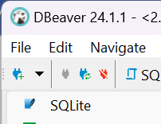
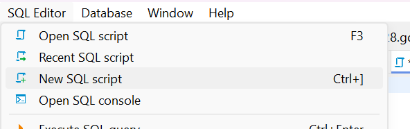
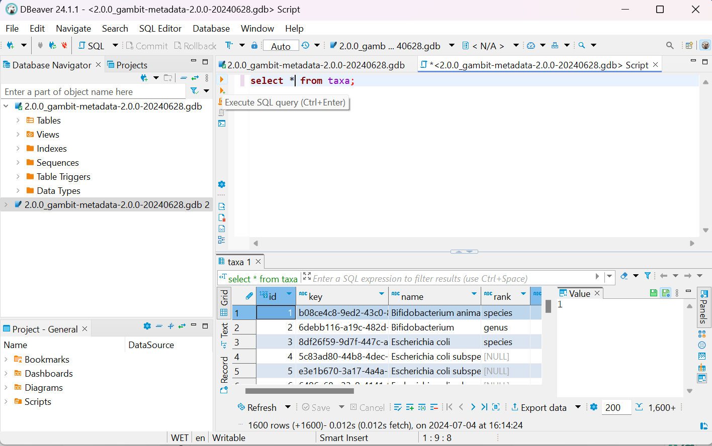
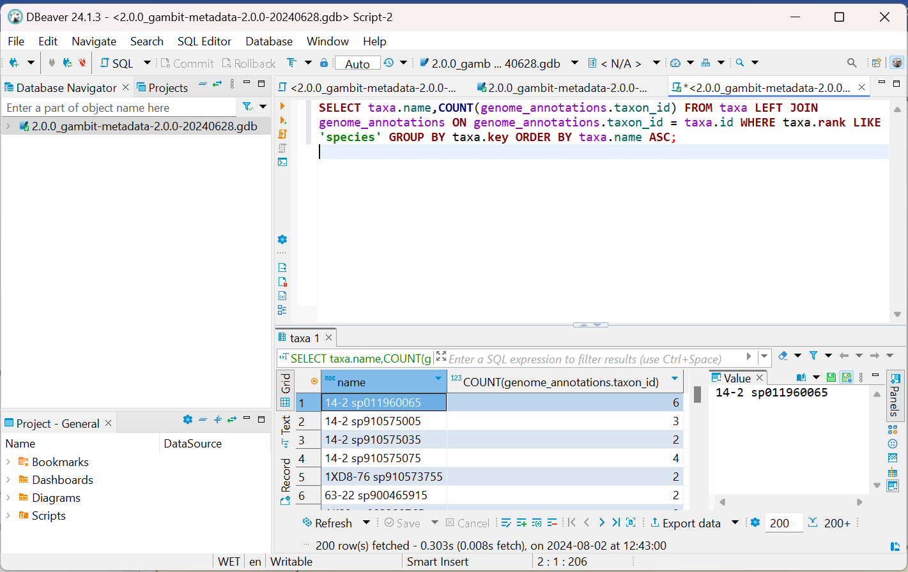
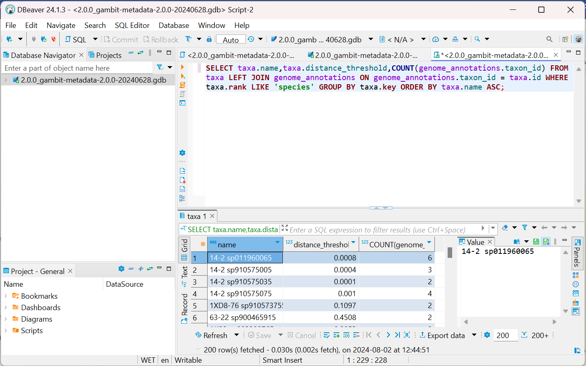

# GAMBIT Frequently Asked Questions

Please feel free to reach out to <support@theiagen.com> with any questions you might have.

??? toggle "What GAMBIT database should I use?"
    GAMBIT Databases are domain-specific. Currently two domains are available: Bacteria and Fungi. Choosing the appropriate type of database for your data is important as it can lead to erroneous/no classification results.

    As a rule of thumb, we recommend the latest version of any GAMBIT Database to be used. Instances where one might prefer to use an older database, versus the most up to date, include:

    1. Maintaining use of a database that has been validated previously by your laboratory, or 
    2. Utilizing a database that draws the genomes and their annotations from a specific source. For example, bacterial GAMBIT databases v1.0.0 through v1.3.0 draw their genome annotations predominantly from NCBI’s RefSeq database, whereas v2.0.0 draws all genome annotations from GTDB. Database v1.0.0 is also inclusive of all bacterial genomes that were available on RefSeq at the time of creation, whereas v2.0.0 excludes genomes that do not expand the diversity of their species.

??? toggle "How do I list taxa included in a GAMBIT database?"
    There are several ways to retrieve the information regarding which taxa were included in a given GAMBIT database release. The easiest way is to download the taxa list file provided [on the Prokaryotic](./databases/gambit_prokaryotic.md) or [Fungal documentation page](./databases/gambit_fungal.md) for every GAMBIT database release.

    Additionally, there are several programmatic ways to retrieve this information directly from the GAMBIT metadata file (which typically ends in ".gdb"). Here we present a few examples: using [SQLite3](https://www.sqlite.org/), [DBeaver](https://dbeaver.io/) or the [GAMBITtools](https://github.com/gambit-suite/gambittools) software.
    
    ??? example "_Example 1:_ SQLite3"
        To retrieve the list of taxa directly from the database, the following command can be run (after installing SQLite3 through your favourite installer). Substitute `<gambit metadata gdb file>` with your metadata file location.
        
        ```bash
        sqlite3 <gambit metadata gdb file> "SELECT * FROM taxa;" > list-of-taxa.tsv
        ```
        
        To retrieve the list of genomes, the following command can be run. Substitute `<gambit metadata gdb file>` by your metadata file location.
        
        ```bash
        sqlite3 <gambit metadata gdb file> "SELECT * FROM genomes;" > list-of-genome.tsv
        ```
        
    ??? example "_Example 2:_ DBeaver"
        After downloading and installing [DBeaver](https://dbeaver.io/), open the GAMBIT metadata file by clicking on `New Database Connection` (or hitting Ctrl+Shift+N) on the top left corner of the window. Under the SQL section, select the `SQLite` option and open the path to the metadata file. If prompted, install the required drivers by DBeaver. 
        
        !!! caption narrow "SQLite"
            
        
        Select `SQL Editor` in the toolbar and then click on `New SQL Script`. 
        
        !!! caption narrow "New SQL Script"
            
        
        Type `SELECT * FROM taxa;` and check that you get the results (press `CTRL+Enter` or click the orange arrow to execute SQL statements). To save the results click on `Export data`  on the bottom right corner and select what file format to save the information in (we recommend **CSV format** that can then be loaded onto Excel). 
        
        !!! caption narrow "List Taxa"
            
        
    ??? example "_Example 3:_ GAMBITtools"
        The [GAMBITtools](https://github.com/gambit-suite/gambittools) suite of scripts are Python tools written for working with GAMBIT. We recommend using [Docker](https://www.docker.com/) to interact with GAMBITtools. 
        
        After building the gambittools docker image, use the `gambit-list-taxa` command as demonstrated below to generate a list of taxa included in a GAMBIT database. Substitute `<gambit metadata gdb file>` with your metadata file location
        
        ```bash
        docker build -t gambittools .
        ```
        
        ```bash
        docker run -v $(pwd):/data gambittools gambit-list-taxa <gambit metadata gdb file>
        ```
        
??? toggle "How do I get the number of genomes representing a given species?"
    Like retrieving the list of taxa, there are several ways of retrieving the number of species for a given species. 

    ??? example "_Example 1:_ SQLite3"
        To retrieve the list of taxa and respective number of genomes directly from the database, the following command can be run (after installing SQLite3 through your favourite installer). Substitute `<gambit metadata gdb file>` with your metadata file location.
        
        ```bash
        sqlite3 <gambit metadata gdb file> "SELECT taxa.name,COUNT(genome_annotations.taxon_id) FROM taxa LEFT JOIN genome_annotations ON genome_annotations.taxon_id = taxa.id WHERE taxa.rank LIKE 'species' GROUP BY taxa.key ORDER BY taxa.name ASC;" > list-of-taxa-with-number-of-genomes.tsv
        ```
        
    ??? example "_Example 2:_ DBeaver"
        After downloading and installing [DBeaver](https://dbeaver.io/), open the GAMBIT metadata file by clicking on `New Database Connection` (or hitting Ctrl+Shift+N) on the top left corner of the window. Under the SQL section, select the `SQLite` option and open the path to the metadata file. If prompted, install the required drivers by DBeaver. 
        
        
        !!! caption narrow "SQLite"
            
        
        
        Select `SQL Editor` in the toolbar and then click on `New SQL Script`. 
        
        !!! caption narrow "New SQL Script"
            

        Type `SELECT taxa.name,COUNT(genome_annotations.taxon_id) FROM taxa LEFT JOIN genome_annotations ON genome_annotations.taxon_id = taxa.id WHERE taxa.rank LIKE 'species' GROUP BY taxa.key ORDER BY taxa.name ASC;` and check that you get the results (press `CTRL+Enter` or click the orange arrow to execute SQL statements). To save the results click on `Export data`  on the bottom right corner and select what file format to save the information in (we recommend **CSV format** that can then be loaded onto Excel). 
        
        !!! caption narrow "Number of Genomes"
            
        
??? toggle "How do I get the number of genomes and the distance threshold representing a given species?"
    Like retrieving the list of taxa and the number of genomes representing a given species, there are several ways of retrieving the distance threshold for a given species. 

    ??? example "_Example 1:_ SQLite3"
        To retrieve the list of taxa and respective number of genomes directly from the database, the following command can be run (after installing SQLite3 through your favourite installer). Substitute `<gambit metadata gdb file>` with your metadata file location.
        
        ```bash
        sqlite3 <gambit metadata gdb file> "SELECT taxa.name,taxa.distance_threshold,COUNT(genome_annotations.taxon_id) FROM taxa LEFT JOIN genome_annotations ON genome_annotations.taxon_id = taxa.id WHERE taxa.rank LIKE 'species' GROUP BY taxa.key ORDER BY taxa.name ASC;" > list-of-taxa-with-number-of-genomes.tsv
        ```
        
    ??? example "Example 2: DBeaver"
        After downloading and installing [DBeaver](https://dbeaver.io/), open the GAMBIT metadata file by clicking on `New Database Connection` (or hitting Ctrl+Shift+N) on the top left corner of the window. Under the SQL section, select the `SQLite` option and open the path to the metadata file. If prompted, install the required drivers by DBeaver. 
        
        !!! caption narrow "SQLite"
            
        
        Select `SQL Editor` in the toolbar and then click on `New SQL Script`. 
        
        !!! caption narrow "New SQL Script"
            
        
        Type `SELECT taxa.name,taxa.distance_threshold,COUNT(genome_annotations.taxon_id) FROM taxa LEFT JOIN genome_annotations ON genome_annotations.taxon_id = taxa.id WHERE taxa.rank LIKE 'species' GROUP BY taxa.key ORDER BY taxa.name ASC;` and check that you get the results (press `CTRL+Enter` or click the orange arrow to execute SQL statements). To save the results click on `Export data`  on the bottom right corner and select what file format to save the information in (we recommend **CSV format** that can then be loaded onto Excel). 
        
        !!! caption narrow "Number of Genomes and Distance Threshold"
            
    
??? toggle "How do I create a custom GAMBIT database?"

    Creating a custom GAMBIT database can be a laborious task. The easiest way to go about it is to reach out to Theiagen Genomics at [support@theiagen.com](mailto:support@theiagen.com) to request assistance. A guide can be found on [GAMBIT Database Creation page](./databases/creating_database.md) 
    
??? toggle "How well does GAMBIT perform discerning between _Escherichia coli_ and _Shigella_ sp?"

    Escherichia coli and Shigella are closely genetically related, to the extent that they would be considered the same species if not for their distinguishing phenotypic characteristics. GAMBIT databases are curated to enable differentiation between the two groups, however, it is worth bearing in mind that these genomes are highly genetically similar thus tools that take a more granular approach to genome comparison may be more reliable. 
    
??? toggle "What should I do if a GAMBIT taxonomic assignment does not align with the expected results based on another bioinformatics tool or molecular testing?"

    In this instance, please reach out to [support@theiagen.com](mailto:support@theiagen.com) and David Hess at the Nevada State Public Health Laboratory [dhess@med.unr.edu](mailto:dhess@med.unr.edu). We will be happy to investigate your sample and improve the GAMBIT database in subsequent versions!
    
---