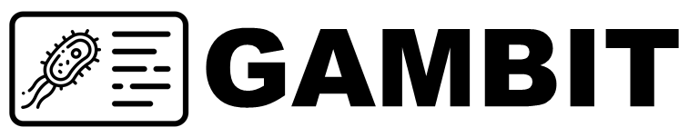

# GAMBIT Documentation

  

**GAMBIT (Genomic Approximation Method for Bacterial Identification and Tracking)** determines the taxon of the query genome assembly using a ***k*-mer-based approach** to match the assembly sequence to the closest complete genome in a database.

!!! dna "GAMBIT genomic distance metric correlates with sequence identity!"
    GAMBIT uses an efficient genomic distance metric along with a curated database to identify genome assemblies in seconds. You can read more about how the distance metric is calculated in the [Technical Details](./technical_details.md) section!

## Getting Started

If the **distance between the query genome assembly and the closest genome in the database is within a built-in species threshold**, GAMBIT will assign the query genome to that species. Species thresholds are determined through a combination of automated and manual curation processes based on the diversity within the taxon.

/// html | div[class="grid cards" markdown]

-   
[Terra Users](getting_started/terra.md){ .md-button .md-button--secondary }

    ---

    Learn how to use our workflows on Terra!

-   
[Command-line Users](getting_started/commandline.md){ .md-button .md-button--secondary }

    ---

    Learn how to use our workflows on the command-line!

///

!!! tip "GAMBIT includes a manually curated, high-quality database!"
    GAMBIT databases consist of two files:

    1. A **signatures file** containing the GAMBIT signatures (compressed representations) of all genomes represented in the database 
    2. A **metadata file** relating the represented genomes to their genome accessions, taxonomic identifications, and species thresholds
  

-   :material-file-code: **Latest GAMBIT Version**

    ---

    [GAMBIT v1.1.0 source code](https://github.com/jlumpe/gambit/releases/tag/v1.1.0)

    [GAMBITdb-nf source code](https://github.com/gambit-suite/gambitdb-nf)

-   :material-database: **Latest Database Version**

    ---

    [GAMBIT Prokaryotic GTDB Database v2.1.0](./databases/gambit_prokaryotic.md#gambit-gtdb-database-v210)

    [GAMBIT Fungal Database v1.0.0](./databases/gambit_fungal.md#gambit-fungal-database-v100)

## Citation

Please cite this paper if publishing work using **GAMBIT**:

> Lumpe J, Gumbleton L, Gorzalski A, Libuit K, Varghese V, Lloyd T, et al. (2023) GAMBIT (Genomic Approximation Method for Bacterial Identification and Tracking): A methodology to rapidly leverage whole genome sequencing of bacterial isolates for clinical identification. PLoS ONE 18(2): e0277575. <https://doi.org/10.1371/journal.pone.0277575>

Please cite the reference below when using the **GAMBIT Fungal Database v0.2.0:**

> Ambrosio III, F. J., Scribner, M. R., Wright, S. M., Otieno, J. R., Doughty, E. L., Gorzalski, A., ... & Hess, D. (2023). TheiaEuk: a species-agnostic bioinformatics workflow for fungal genomic characterization. _Frontiers in Public Health_, _11_. <https://doi.org/10.3389/fpubh.2023.1198213>

## Help Available

Please feel free to reach out to <support@theiagen.com> with any questions you might have.